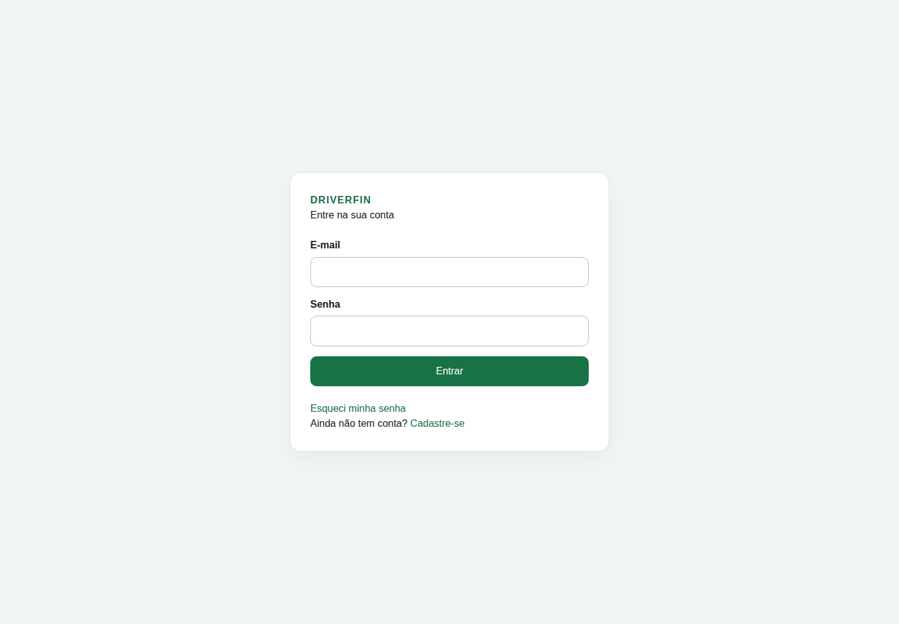
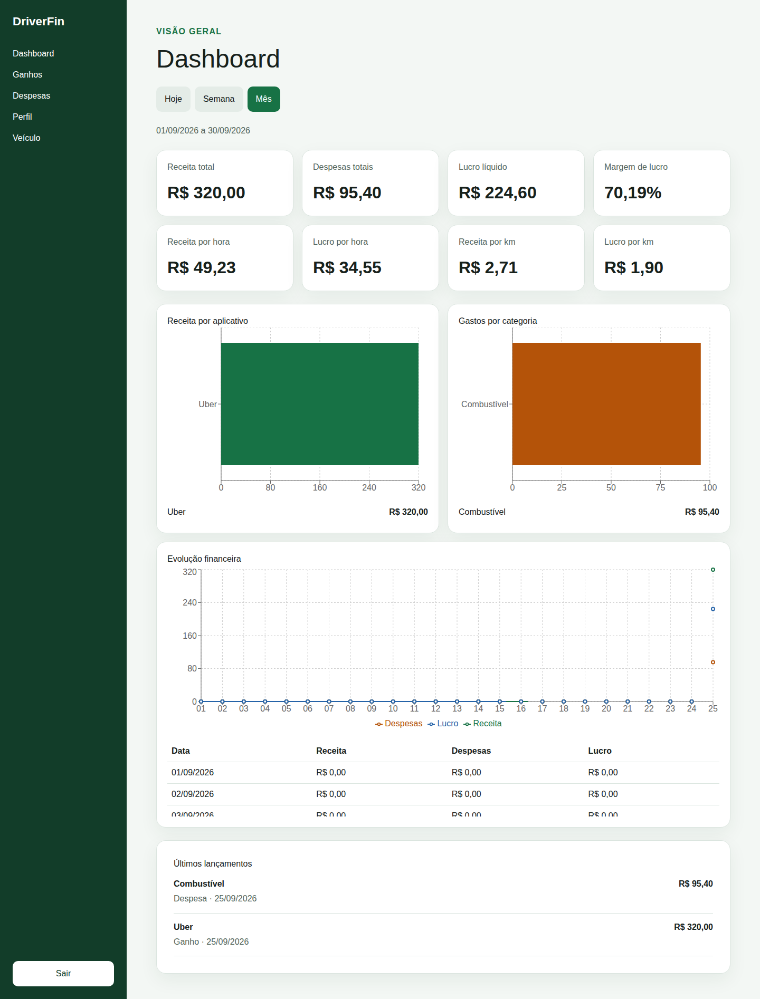
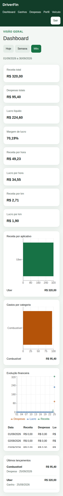
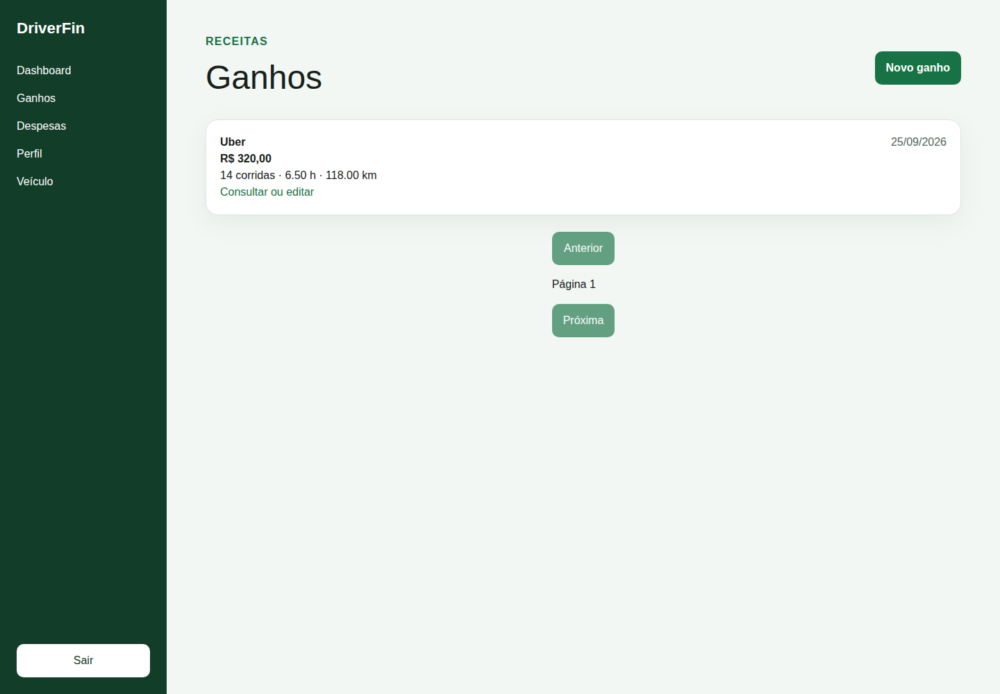
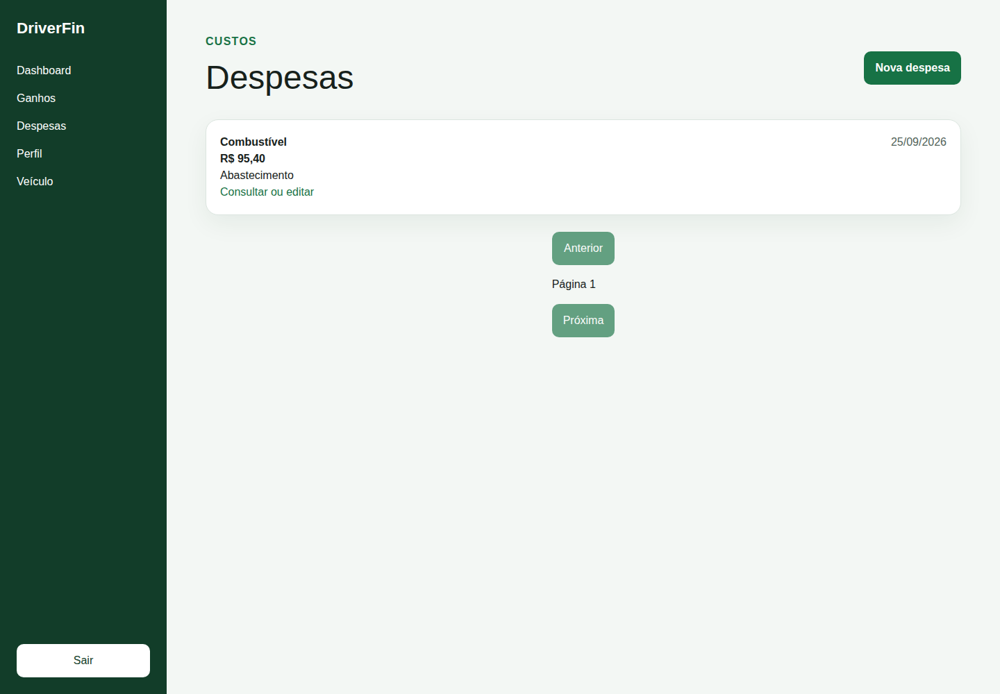

# DriverFin

O DriverFin é uma aplicação web responsiva para motoristas de aplicativo registrarem
ganhos e despesas e entenderem o resultado real do trabalho por período, hora e
quilômetro.

O DriverFin nasceu como projeto de portfólio a partir de um problema recorrente: os dados
financeiros do motorista ficam dispersos e a receita bruta não mostra quanto realmente
restou. A solução reúne os lançamentos manuais em uma fonte financeira única e calcula os
indicadores no backend, apresentando um dashboard simples para celular e desktop. Com a
V1 publicada e validada, o projeto passa a servir também como base para a construção de um
negócio, sem alterar retrospectivamente o escopo desta entrega.

## Aplicação publicada

- Frontend: [https://driver-fin-web-beta.vercel.app](https://driver-fin-web-beta.vercel.app)
- API: [https://driverfin-production.up.railway.app](https://driverfin-production.up.railway.app)
- Health: [https://driverfin-production.up.railway.app/api/health](https://driverfin-production.up.railway.app/api/health)

## Funcionalidades

- Cadastro, login, logout e recuperação de senha por e-mail.
- Consulta do perfil e cadastro de um único veículo.
- CRUD completo de ganhos e despesas.
- Dashboard com filtros Hoje, Semana e Mês.
- Receita total, despesas, lucro líquido e margem.
- Receita e lucro por hora e por quilômetro.
- Receita por plataforma, gastos por categoria e evolução financeira.
- Últimos lançamentos do período.
- Estados de carregamento, vazio, validação, falha e resultado incerto.
- Isolamento dos dados de cada usuário e interface responsiva.

## Stack

| Camada | Tecnologias |
|---|---|
| Frontend | Next.js, React, TypeScript, Tailwind CSS, shadcn/ui e Recharts |
| Backend | NestJS e Node.js |
| Banco | PostgreSQL e Prisma |
| Infraestrutura | Docker, Railway e Vercel |
| E-mail | Resend |
| Testes | Jest, Supertest e Playwright |

## Arquitetura

```text
Navegador
   │
   ▼
Next.js ──rewrite /api──▶ REST API ──▶ NestJS ──Prisma──▶ PostgreSQL
                               │
                               └──▶ Resend (recuperação de senha)
```

O frontend chama `/api` na própria origem. O rewrite do Next.js encaminha as requisições
para a API NestJS, que concentra autenticação, autorização, regras financeiras e acesso
ao PostgreSQL. O navegador não acessa o banco nem recebe a origem interna como variável
pública.

## Execução local

### Pré-requisitos

- Node.js `>=24 <25` (a versão de desenvolvimento está em `.nvmrc`).
- npm `>=11 <12`.
- Docker com Docker Compose.
- Git.

As portas padrão são 3000 para a web, 3001 para a API e 5433 para o PostgreSQL.

### Instalação e ambiente

Na raiz do repositório:

```bash
nvm use
cp .env.example .env
cp apps/api/.env.example apps/api/.env
cp apps/web/.env.example apps/web/.env.local
npm ci
```

Troque os placeholders locais nos arquivos copiados. Mantenha `POSTGRES_PASSWORD` e as
URLs `DATABASE_URL`/`TEST_DATABASE_URL` coerentes. `JWT_ACCESS_SECRET` deve possuir ao
menos 32 bytes. Para testar recuperação real, informe credenciais próprias do Resend;
testes automatizados usam um provider substituto e não enviam e-mail real.

Os arquivos `.env` reais são ignorados pelo Git. As variáveis principais são:

- Compose: `POSTGRES_USER`, `POSTGRES_PASSWORD` e `POSTGRES_DB`.
- API: `DATABASE_URL`, `TEST_DATABASE_URL`, `PORT`, `NODE_ENV`, `WEB_ORIGIN`,
  `JWT_ACCESS_SECRET`, `JWT_ISSUER`, `JWT_AUDIENCE`, `RESEND_API_KEY` e `RESEND_FROM`.
- Web: `API_ORIGIN`, com a origem absoluta da API e sem o sufixo `/api`.

### Banco, Prisma e catálogos

```bash
docker compose up -d --wait db
npm run db:generate --workspace apps/api
npm run db:deploy --workspace apps/api
npm run db:seed --workspace apps/api
```

`db:deploy` aplica somente migrations versionadas. O seed é idempotente e mantém os
catálogos fixos de plataformas e categorias sem criar dados pessoais.

### API e frontend

Execute em terminais separados, ambos a partir da raiz:

```bash
npm run dev --workspace apps/api
```

```bash
npm run dev --workspace apps/web
```

Acesse [http://localhost:3000/login](http://localhost:3000/login). O health pode ser
consultado diretamente em `http://localhost:3001/api/health` ou pelo rewrite em
`http://localhost:3000/api/health`.

### Verificações principais

O banco de testes deve se chamar exclusivamente `driverfin_test`. Se ele ainda não
existir no Compose local, crie-o uma vez:

```bash
docker compose exec -T db createdb -U driverfin driverfin_test
```

Depois execute:

```bash
npm run format:check
npm run db:generate --workspace apps/api
npm run lint
npm run typecheck
npm run test:unit --workspace apps/api
npm run test:foundation --workspace apps/api
npm run test:integration --workspace apps/api
npm run build
npm exec --workspace apps/web -- playwright install chromium webkit
npm run test:e2e --workspace apps/web
```

Mais detalhes, cenários e cuidados com o banco de teste estão no
[quickstart de validação](specs/001-driverfin-v1/quickstart.md).

## Deploy

- A web Next.js está na Vercel, com `apps/web` como Root Directory e `API_ORIGIN`
  configurada somente no servidor/build.
- A API e o PostgreSQL estão na Railway. A imagem usa
  [`apps/api/Dockerfile`](apps/api/Dockerfile), executa migrations por
  `npm run db:deploy --workspace apps/api` no pre-deploy e inicia como usuário não-root.
- `WEB_ORIGIN` restringe a origem aceita pela API. Produção usa HTTPS, cookie de refresh
  seguro e respostas privadas sem cache.
- O Resend envia apenas o fluxo de recuperação de senha. Chaves, secrets JWT e URLs de
  banco não são documentados nem versionados.

## Decisões técnicas

- Monorepo npm simples com workspaces `apps/web` e `apps/api`, sem orquestrador adicional.
- REST para manter explícito o contrato entre Next.js e NestJS.
- Access token JWT em memória e refresh token opaco em cookie HttpOnly.
- PostgreSQL e Prisma para integridade relacional e migrations versionadas.
- Dinheiro persistido com precisão decimal; cálculos usam inteiros/`BigInt`, sem depender
  de ponto flutuante.
- Dashboard calculado no backend, que é a única fonte das fórmulas financeiras.
- Ganhos e despesas formam a fonte financeira única da V1.
- Docker para um artefato reproduzível da API; Railway para API/banco e Vercel para web.
- Resend limitado à recuperação de senha, sem criar uma infraestrutura de notificações.

## Screenshots

### Login



### Dashboard desktop



### Dashboard mobile



### Ganhos



### Despesas



As imagens acima foram capturadas da aplicação publicada com uma conta de demonstração
isolada e dados fictícios.

## Melhorias futuras — Backlog V2

Sem compromisso com a V1 atual, o backlog inclui múltiplos veículos, integrações com
Uber/99, Open Finance, importações, OCR, manutenção preventiva, metas, notificações, PWA,
aplicativo nativo, dark mode, login social, exportações, análises com IA e planos pagos.

> Projeto desenvolvido para portfólio a partir de um cenário inspirado em uma demanda real de mercado. Não possui vínculo com o solicitante original.
