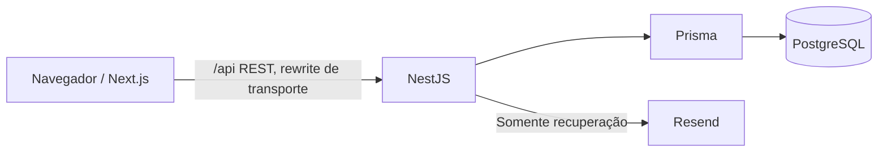

# Implementation Plan: DriverFin V1

**Branch**: `main` | **Date**: 2026-09-08 | **Spec**: [spec.md](spec.md)

**Input**: `specs/001-driverfin-v1/spec.md`, constituição v1.0.0 e stack definida pelo usuário.

**Status**: Planejamento técnico concluído; implementação e validação executável são etapas futuras.
O setup resolveu FEATURE_SPEC, IMPL_PLAN e SPECS_DIR pela feature.json; BRANCH veio vazio.
A branch `main` foi confirmada diretamente no Git, sem criar ou trocar branch.

## Summary

Construir a V1 inteira em duas aplicações npm workspaces: Next.js App Router na Vercel
e REST NestJS na Railway, com PostgreSQL no mesmo projeto Railway. Prisma controla dados
e migrations. Resend envia exclusivamente recuperação de senha. Sem packages preventivos,
Redis, filas, GraphQL ou outros componentes proibidos.

Perfil permanece somente leitura; veículo permite apenas cadastro e consulta, um por
usuário. Ganhos/despesas têm CRUD; dashboard possui os 12 componentes e três filtros do
spec, iniciando em Mês. Nenhuma edição de perfil/veículo, período personalizado ou V2.
O plano detalha decisões e sequência de entrega, sem gerar tasks.md.

## Technical Context

**Language/Version**: TypeScript 5.9, Node.js 24 LTS, npm 11; patches estáveis compatíveis
fixados no lockfile na fundação, Node também em `.nvmrc`, engines e provedores.

**Primary Dependencies**: Next.js 16, React 19, Tailwind CSS 4, shadcn/ui local,
Recharts 3; NestJS 11 com adaptador Express padrão, Prisma 7, pg/adapter-pg;
@nestjs/config, @nestjs/jwt, class-validator/class-transformer, argon2 e Resend SDK.
Usar apenas dependências necessárias aos componentes efetivamente adicionados.

**Storage**: PostgreSQL 17 local/produção; schema e migrations Prisma em apps/api/prisma.

**Testing**: Jest + Supertest na API; PostgreSQL real de teste via Compose; Playwright
para jornadas essenciais. Validação manual de todos os cenários críticos e responsividade.

**Target Platform**: Navegadores atuais desktop e mobile; validar 360/390/768/1366 pixels
conforme SC-006 e toque real antes de publicar.

**Project Type**: Monorepo simples de aplicação web cliente-servidor, duas aplicações independentes.

**Performance Goals**: SC-002: despesa em até 30s e ganho em até 60s em teste manual nas
condições do spec. Listas paginadas em 20 itens e agregações por usuário/data no banco,
sem carregar histórico inteiro. Sem inventar SLA, escala comercial ou meta de cobertura.

**Constraints**: Escopo fechado, uma área funcional principal em conclusão por vez,
fonte financeira única, autorização no servidor, deploy e README obrigatórios.

**Scale/Scope**: Seis jornadas, 23 FRs, nove RNs, 13 telas (quatro públicas e nove privadas),
seis entidades de domínio e duas técnicas. Uma API e um banco, sem serviços de V2.

Decisões e documentação consultada estão em [research.md](research.md).

## Constitution Check

Gate inicial: aprovado pela leitura de spec/constituição antes de escolher o desenho.
Gate pós-design: aprovado após revisar os artefatos abaixo. Resultados significam
conformidade do **plano**, não testes executados ou produto concluído.

| Gate | Antes da pesquisa | Após design / evidência |
|------|-------------------|--------------------------|
| Escopo VII/XVII | Conforme | FR-001–023 rastreados; perfil/veículo restritos e exclusões preservadas. |
| Arquitetura IV | Conforme | Next → REST Nest → Prisma → PostgreSQL, Resend somente recuperação. |
| Simplicidade IV/IX | Conforme | Dois workspaces, seis módulos de domínio, um PrismaModule; sem packages genéricos. |
| Dados V | Conforme | data-model.md: oito entidades justificadas, veículo unique e migrations. |
| Finanças VI | Conforme | RN-007/008 implementadas em domínio único, dinheiro exato e razão nula explícita. |
| Segurança VIII | Conforme | Sessões verificadas no servidor, hash seguro, isolamento e reset transacional. |
| UX III/XII/XIII | Conforme | Formulário único, estados definidos e responsividade por história. |
| Incremental X | Conforme | Sequência abaixo conclui e integra a história antes da próxima. |
| Testes XI | Conforme | Unitários, integração real, E2E essenciais e manual vinculados aos SCs. |
| Publicação XIV–XVI | Conforme | Deploy, migrations, Resend, URL e README tratados como gates de entrega. |

Nenhuma exceção constitucional solicitada. Custos, DNS e segredos são dependências
operacionais a resolver no deploy, sem mudar o MVP aprovado.

## Project Structure

### Documentation (this feature)

```text
specs/001-driverfin-v1/
├── spec.md
├── plan.md
├── research.md
├── data-model.md
├── contracts/rest-api.md
├── quickstart.md
└── checklists/requirements.md
```

tasks.md será produzido somente por speckit-tasks. A constituição e o spec não são
alterados pelo planejamento. O bloco gerenciado de AGENTS.md aponta para este plano.

### Source Code (repository root)

Estrutura planejada, ainda não criada:

```text
apps/
├── web/
│   ├── src/
│   │   ├── app/
│   │   │   ├── (public)/{login,cadastro,recuperar-senha,redefinir-senha}/page.tsx
│   │   │   ├── (private)/layout.tsx
│   │   │   ├── (private)/dashboard/page.tsx
│   │   │   ├── (private)/ganhos/{page.tsx,novo/page.tsx,[id]/editar/page.tsx}
│   │   │   ├── (private)/despesas/{page.tsx,nova/page.tsx,[id]/editar/page.tsx}
│   │   │   ├── (private)/{veiculo,perfil}/page.tsx
│   │   │   └── {layout.tsx,page.tsx,globals.css}
│   │   ├── components/{ui,layout,feedback}/
│   │   ├── features/{auth,vehicle,earnings,expenses,dashboard,profile}/
│   │   └── lib/{api-client.ts,format.ts}
│   ├── tests/e2e/
│   ├── playwright.config.ts
│   ├── next.config.ts
│   ├── .env.example
│   └── package.json
└── api/
    ├── src/
    │   ├── {main.ts,app.module.ts,health.controller.ts}
    │   ├── prisma/{prisma.module.ts,prisma.service.ts}
    │   ├── generated/prisma/                # gerado, não editado/versionado
    │   ├── common/{filters,validation,calendar}/
    │   ├── auth/{dto,guards,auth.controller.ts,auth.service.ts,password-mailer.ts}
    │   ├── users/{users.module.ts,users.controller.ts,users.service.ts}
    │   ├── vehicles/{dto,vehicles.module.ts,vehicles.controller.ts,vehicles.service.ts}
    │   ├── earnings/{dto,earnings.module.ts,earnings.controller.ts,earnings.service.ts}
    │   ├── expenses/{dto,expenses.module.ts,expenses.controller.ts,expenses.service.ts}
    │   └── dashboard/{dto,domain,dashboard.module.ts,dashboard.controller.ts,dashboard.service.ts}
    ├── prisma/{schema.prisma,migrations,seed.ts}
    ├── prisma.config.ts
    ├── test/{integration,fixtures}/
    ├── Dockerfile
    ├── .env.example
    └── package.json
.github/workflows/ci.yml
docker-compose.yml
.env.example                               # somente variáveis Compose locais
package.json
package-lock.json
.nvmrc
README.md
```

auth inclui também auth.module.ts; testes unitários ficam próximos às funções testadas.
As chaves no desenho abreviam arquivos/rotas, não nomes literais de diretórios.

**Structure Decision**: workspaces explícitos `["apps/web", "apps/api"]`, raiz private.
Build/test de cada aplicação independente; lockfile na raiz. Sem Nx/Turborepo, pasta
packages ou configuração TypeScript compartilhada por antecipação. Manter DTOs backend
e tipos de transporte frontend locais, comparados por testes de contrato. No fechamento,
renomear o `readme.md` existente para `README.md` preservando conteúdo e links, sem duplicar.

## Arquitetura final e fronteiras



Next.js entrega UI e encaminha `/api` à origem fixa configurada; não faz consultas Prisma,
cálculos financeiros, validação autoritativa ou autenticação paralela. Não usar Server
Actions para duplicar mutações REST. Inicialização privada no cliente renova sessão e
consulta perfil antes de mostrar dados; proteger páginas no frontend é apenas UX.

Rewrite em next.config.ts: `/api/:path*` → `API_ORIGIN/api/:path*`; destino exclusivamente
configurado, nunca recebido do usuário. Preservar Authorization, Cookie e Set-Cookie,
sem cache. A API pode ser consumida diretamente por testes/clientes autorizados.

## Backend por domínio

| Módulo | Responsabilidade concreta |
|--------|---------------------------|
| auth | Cadastro, login, refresh, logout, reset, JWT guard, sessão e provider Resend. |
| users | Consulta do próprio perfil; nenhuma edição/exclusão. |
| vehicles | Consulta/cadastro único e opções Fuel. |
| earnings | CRUD próprio e catálogo de plataformas somente leitura. |
| expenses | CRUD próprio e catálogo de categorias somente leitura. |
| dashboard | Snapshot agregado, período único e funções financeiras puras. |
| prisma | Conexão única por processo e ciclo de vida; infraestrutura exigida pelo banco. |

Controllers recebem DTOs, aplicam status/headers e delegam a services. Services controlam
casos de uso, filtros userId e transações. Sem base controller, generic repository, CQRS,
camadas de interfaces para cada classe ou módulo global de negócio.

ValidationPipe global: whitelist, forbidNonWhitelisted e transformação restrita; validar
strings numéricas explicitamente, sem coerção implícita que converta vazio em zero.
Validadores de decimal/data em common porque são usados por ganhos e despesas; calendário
compartilhado dentro da API porque também valida datas e ano. Regras de negócio continuam
nos domínios. Constraint única do banco é a defesa final para e-mail/veículo concorrentes.

Guard global verifica JWT e AuthSession; marcar explicitamente apenas as rotas públicas
do contrato. Leituras/updates/deletes por id sempre incluem userId da sessão. UPDATE e
DELETE condicionais retornam 404 genérico se zero linhas; não buscar registro alheio para
informar proprietário. Sem upsert de registros removidos. Mutações revalidam autorização
na transação serializada com logout/reset. Error filter converte erros conhecidos para o
contrato e omite dados internos. `/health` apenas verifica prontidão, sem módulo extra.

## Dados e API REST

Modelo completo: [data-model.md](data-model.md). Contratos de métodos, rotas, autenticação,
entradas, saídas, paginação e erros: [contracts/rest-api.md](contracts/rest-api.md).

Plataformas/categorias entram na migration inicial com IDs estáveis; seed idempotente
para local/teste. Fuel é enum e endpoint de leitura, sem tela administrativa. Prisma 7
usa geração explícita antes do build, adapter-pg e prisma.config.ts. CHECKs adicionais
são SQL revisado e versionado dentro das migrations Prisma. Não usar db push em produção.

Build Prisma/NestJS em ESM: definir `"type": "module"` em apps/api/package.json e
`module: "NodeNext"` / `moduleResolution: "NodeNext"` no tsconfig da API, mantendo
`experimentalDecorators` e `emitDecoratorMetadata` habilitados. Usar o generator
`prisma-client` com output `../src/generated/prisma`, `moduleFormat = "esm"`,
`generatedFileExtension = "ts"` e `importFileExtension = "js"`. Imports relativos da
API devem usar extensão `.js`, inclusive ao importar o client gerado. Compilar o client
junto com o Nest após `prisma generate`; preservar o package.json com tipo ESM na imagem
final e alinhar o executor de testes ao mesmo formato. Validar build, testes e startup
do JavaScript compilado na imagem Node 24 antes de avançar na implementação.

## Autenticação e recuperação

1. Cadastro normaliza nome/e-mail, preserva senha e gera Argon2id
   (64 MiB, três iterações, paralelismo 1 e salt aleatório). Unique email resolve
   corrida. Não inicia sessão automaticamente nem exige campos novos.
2. Login valida credenciais e cria AuthSession; access JWT de 15 min com sub/sid/iss/aud,
   refresh opaco de 32 bytes, hash SHA-256, expiração absoluta de sete dias. JWT usa HS256
   com segredo aleatório de pelo menos 32 bytes, algoritmo/issuer/audience fixos na verificação.
3. JWT fica somente em memória; refresh fica em cookie HttpOnly, Secure produção,
   SameSite=Lax, host-only, Path=/api/auth. Sem localStorage e sem rotação/renovação da
   validade absoluta nesta V1. Guard consulta sessão no banco em cada requisição.
4. Refresh único em andamento por aba; no reload restabelece acesso. Sem rotação, abas
   não disputam troca de token. 401 explícito sem gravação permite refresh e uma repetição;
   rede incerta em mutação não permite reenvio automático.
5. Logout revoga sessão atual e limpa cookie mesmo com access expirado, identificando
   sessão via refresh ou JWT verificável. Limpar estado em memória, bloquear telas durante
   revalidação ao retornar por histórico/pageshow e revalidar ao focar aba. Logout/reset
   concluídos invalidam acesso no servidor, não apenas na UI.
6. Solicitação de recuperação retorna 202 genérico; token randômico armazenado só como
   hash, expira em 30 min. Chamar Resend após transação, com URL pública configurada,
   sem domínio/link informado pelo solicitante. Não enviar outros tipos de mensagem.
7. Redefinição valida campos antes de consumir token. Sob lock User: verificar token
   ainda válido, trocar senha, marcar usado, revogar links pendentes e todas as sessões.
   Invalidar na igualdade com expiresAt. Login usa mesmo lock e relê hash antes de criar
   sessão, impedindo login com senha anterior em corrida. Provider externo nunca roda sob lock.

Origin allowlist, JSON e cabeçalho de cliente nas ações de cookie reduzem CSRF; CORS com
origens explícitas e credentials, sem wildcard. Backend rejeita origem ausente/não permitida
nesses endpoints. Header não é segredo nem mecanismo de autorização. HTTPS obrigatório em
produção. Logs omitem Authorization, Cookie, Set-Cookie, senhas, hashes e tokens.

## Estratégia financeira e dos períodos

`dashboard/domain/financial-summary.ts` é a única fonte das fórmulas de RN-007/008.
Recebe somas exatas, não instâncias de controller. Para centavos C, despesas D, centésimos
de hora H e centésimos de km K, todos BigInt:

- Lucro em centavos = C − D.
- Receita/hora em centavos = arredondar(C × 100 / H); lucro/hora usa (C − D).
- Receita/km e lucro/km usam K com a mesma regra.
- Margem em centésimos de percentual = arredondar((C − D) × 10000 / C).
- Arredondamento: dividir valores absolutos, comparar 2 × resto com denominador; em
  igualdade incrementar magnitude e reaplicar sinal. Zero denominador retorna null/motivo.

Converter resultado inteiro em string de duas casas somente ao serializar. Sem média de
razões nem arredondamento prévio. Somar exatamente NUMERIC antes da conversão; BigInt
remove limitação de precisão intermediária. Prisma Decimal/strings fazem I/O, nunca
parseFloat. Frontend só formata strings e traduz ausência de denominador. Recharts pode
receber number apenas para coordenadas visuais; tooltips/legendas mantêm strings exatas.

`common/calendar` recebe relógio injetável, resolve hoje em America/Sao_Paulo e retorna
datas inclusivas para today/week/month. Segunda inicia a semana; endDate inclui domingo
ou último dia do mês; seriesEndDate=min(hoje,endDate). Datas financeiras via @db.Date
são serializadas de volta como YYYY-MM-DD, sem timezone do navegador ou do host.

DashboardService resolve período uma vez e executa consultas filtradas por userId/date
numa transação read-only RepeatableRead: somas dos ganhos/despesas, groupBy plataforma,
categoria e dia, e os cinco primeiros de cada tipo. Mesclar os dez candidatos por
date/createdAt/id (type apenas em empate final) e selecionar cinco. Produz uma resposta
com os 12 componentes; nenhum endpoint separado por card e nenhum histórico inteiro
carregado em memória. Completar dias vazios até hoje. Não agregar por data de criação.

## Frontend, telas e componentes

| Área/rotas | Implementação principal |
|------------|-------------------------|
| /login, /cadastro | Formulários auth com estado local, validação básica de campo e retorno à API. |
| /recuperar-senha, /redefinir-senha | Solicitação genérica; link em fragmento lido em memória, removido da URL; nova senha e retorno ao login. |
| /dashboard | PeriodFilter, SummaryCards, PlatformRevenueChart, CategoryExpensesChart, FinancialEvolutionChart, RecentEntries. |
| /ganhos, /ganhos/novo, /ganhos/[id]/editar | Lista paginada, consulta completa no item, EarningForm compartilhado entre criação/edição. |
| /despesas, /despesas/nova, /despesas/[id]/editar | Lista paginada, consulta completa, ExpenseForm único; descrição opcional. |
| /veiculo | Mostra cadastro ou formulário inicial, sem editar/excluir; não bloqueia finanças. |
| /perfil | Mostra somente nome/e-mail; nenhuma configuração adicional. |

Raiz `/` encaminha para dashboard/login conforme inicialização de sessão.
Shell privado com navegação clara; menu mobile compacto e navegação lateral desktop.
Formulários em uma página, label e erro por campo, inputMode decimal para valores;
strings preservadas durante digitação. Excluir usa uma confirmação AlertDialog simples.
shadcn: Button, Input, Label, Select, Card, Alert, AlertDialog e Skeleton quando necessários.
Não instalar tema/dark mode ou camada adicional de componentes genéricos.

Dashboard: três totais em destaque, margem e quatro razões em seção secundária;
distribuições em barras horizontais com nomes/valores, evolução em gráfico de linhas
com receita/despesa/lucro. Oito indicadores numéricos + três gráficos + últimos lançamentos
cobrem os 12 componentes. Filtro único inicia month; resposta inteira é substituída de
uma vez. Limites exibidos vêm da API. AbortController e identificador de consulta impedem
resposta antiga de sobrescrever filtro novo. Buscar dados ao entrar/focar novamente e
após mutações confirmadas; sem cache financeiro persistente, polling ou estado global extra.

Mobile first: uma coluna no menor tamanho, cards/listas que quebram texto, min-width:0,
contêineres de gráfico com altura explícita, ações por toque e teclado; desktop expande
colunas sem largura fixa maior que viewport. Não esconder overflow para mascarar defeitos.
Testar Recharts por toque, tooltip e consulta textual acessível, inclusive valores negativos.

## Estados e falhas

O contrato de erro define writeOutcome e requestId. Implementar componentes pequenos de
feedback realmente usados em mais de uma tela, não um framework de estados.

| Situação | Resposta da UI |
|----------|---------------|
| Loading inicial/filtro | Skeleton/indicador; não mostrar zero nem números antigos como atuais. |
| Salvando | Desabilitar envio repetido, manter texto de andamento. |
| Sucesso | Confirmação explícita e lista atualizada; recálculo na próxima consulta. |
| Validação | Erro por campo, preservar valores não sensíveis, sem parcial. |
| Erro de consulta | Aviso + tentar novamente; não confundir com vazio. |
| Falha confirmada de gravação | writeOutcome=not_applied: informar não salvo, permitir tentativa consciente. |
| Resultado incerto | Rede/timeout/unknown: não repetir; informar incerteza e orientar consultar lista. |
| Lista vazia | Explicar ausência e acesso ao cadastro; manter paginação recuperável após exclusão. |
| Dashboard vazio | Totais zero após resposta, razões “—” com motivo, gráficos vazios explicados. |
| Sessão expirada | Tentar refresh conforme contrato; se inválido, limpar dados e pedir login. |
| Registro indisponível | Mensagem genérica e retorno à lista, sem recriar registro removido. |

## Estratégia de testes

| Camada | Cobertura necessária | Ferramenta/evidência |
|--------|---------------------|---------------------|
| Unitários | Fórmulas, 0,10+0,20, prejuízo, denominadores zero, razões não médias, empate positivo/negativo e somas grandes. | Jest sobre módulo financeiro puro; SC-003. |
| Unitários | Hoje/semana/mês, segunda/domingo, virada ano, fevereiro bissexto e instante próximo à meia-noite SP. | Relógio fixo, sem depender da data do CI; RN-005/006. |
| Integração | Auth, senha longa/espaços, email case-insensitive, guard, refresh, logout, resets inválido/expirado/usado, links/sessões invalidados. | Jest+Supertest e PostgreSQL; FR-001–006. |
| Integração | Login concorrente com reset, dois resets, escrita concorrente com logout, cadastro concorrente de veículo. | Transações reais/barreiras controladas; nenhuma chamada Resend real. |
| Integração | Dados de dois usuários: GET/list/PUT/DELETE/dashboard/perfil/veículo, propriedade injetada e IDs alheios. | Banco real e HTTP direto, não só UI; SC-005. |
| Integração | CRUD, zeros explícitos, vazio, categoria/plataforma, casas excessivas, data futura, limites físicos e constraints. | FR-007–015, RN-001–005/009. |
| Integração | Snapshot dashboard, filtros inclusivos, grupos/dias, últimos cinco e efeitos de edição/exclusão. | Fixtures do spec mais lançamentos externos; FR-016–020 e SC-004. |
| E2E essenciais | Cadastro/login/veículo/perfil; ganhos/despesas e dashboard; logout; recuperar/redefinir; sessão inválida. | Playwright navegador+API+banco, provider de e-mail substituído no processo de teste. |
| E2E estados | Toque duplo, falha/timeout, filtro rápido, registro removido e resultado incerto sem reenvio. | Interceptação de rede somente para simular falhas; FR-021–023. |
| Manual | Jornadas US1–US6 em 360/390/768/1366, toque/teclado, gráficos e tempo de formulários. | SC-001/002/006/007; registrar evidências antes de publicar. |
| Smoke produção | URL, cookies/rewrite, recuperação Resend real e ciclo financeiro com conta de teste própria. | SC-008/009; sem cargas ou ações sobre dados alheios. |

Teste E2E de recuperação captura o link do provider fake no harness de testes, sem endpoint
de inspeção na aplicação nem logs de tokens em produção. Jest/Supertest inicia Nest via
TestingModule e substitui apenas provider Resend; Playwright usa harness local sob test.
Banco de teste separado, migrations iguais às de produção, reset somente no banco de teste.
CI executa lint, typecheck, unitários, integração, builds e suíte E2E essencial; não impõe
percentual global nem repete matrizes sem motivo. Testes e responsividade acompanham cada
história; etapas finais consolidam o que já foi validado, sem adiar qualidade para o fim.

## Deploy, ambiente e operação

Combinação selecionada: **Vercel (web) + Railway (API e PostgreSQL) + Resend (recuperação)**.
Uma instância API inicialmente. PostgreSQL com persistência gerenciada, mesma região da
API; conferir backup e procedimento de restauração do serviço contratado. Nenhuma
contratação ou publicação é realizada por esta etapa de planejamento.

| Ambiente/local | Variáveis e uso |
|----------------|----------------|
| Raiz Compose | POSTGRES_USER, POSTGRES_PASSWORD, POSTGRES_DB e porta local 5433; volume próprio para evitar conflito com bancos existentes. |
| API | NODE_ENV, PORT, DATABASE_URL, JWT_ACCESS_SECRET, JWT_ISSUER, JWT_AUDIENCE, WEB_ORIGIN, RESEND_API_KEY, RESEND_FROM. |
| Web | API_ORIGIN, URL absoluta da API sem /api; somente servidor/build. Browser usa /api, sem chave privada NEXT_PUBLIC. |
| Testes | TEST_DATABASE_URL separado; relógio/provider substituídos por injeção exclusiva do harness. |

Tempos (900s, sete dias, 30min), fuso, cookie e origem permitida seguem o plano; não são
preferências do usuário. `.env.example` contém apenas placeholders documentados.
API deve falhar no startup produtivo se segredo, origem ou configuração Resend obrigatória
estiverem ausentes. Não logar URLs de conexão com senha; usar TLS conforme o provedor,
sem desabilitar validação de certificados.

Railway: contexto de build na raiz do repositório, Dockerfile em apps/api. Imagem Node 24
Debian slim, build por workspace após npm ci e prisma generate, usuário não-root no
runtime; preservar no artefato prisma.config.ts, schema/migrations e CLI para pre-deploy.
Não fazer migrations em build ou em cada requisição. Build deve funcionar sem alcançar
banco; fornecer URL sintática de build sem credencial real se a configuração CLI exigir.
Pre-deploy executa `npm run db:deploy --workspace apps/api`, que chama migrate deploy;
só então iniciar `npm run start:prod --workspace apps/api`, ouvindo 0.0.0.0 e PORT.
DB privado para runtime; conexão administrativa autorizada para manutenção, sem expor DB
via frontend. Registrar rollback de aplicação compatível e correção forward de migration,
sem reset de produção. Não rodar seed fictício ou migrate dev em produção.

Vercel: projeto Next.js com Root Directory apps/web e acesso à raiz do workspace para
lockfile; instalação a partir da raiz com npm ci, build do workspace web. API_ORIGIN
aponta para domínio HTTPS da API. Rewrite sem caching e respostas private,no-store.
CORS/API aceita apenas WEB_ORIGIN real e origem local configurada no ambiente local;
preview não acessa banco produtivo por wildcard. Autenticação completa usa a URL canônica
até haver ambiente de preview próprio, que não é requisito da V1.

Resend: verificar domínio remetente e DNS antes do smoke de recuperação para destinatários
reais; chave só na API. Configurar WEB_ORIGIN pública correta nos links, não valor Host da
requisição. Envio ocorre fora de transação; erros têm log sanitizado e resposta genérica.

Publicação final verifica frontend, backend, banco, migrations, cookies, CORS, Resend e
URL. README registra instalação, comandos reais, env, arquitetura, decisões, screenshots,
link público, funcionalidades implementadas, melhorias futuras e aviso constitucional.
Incluir o projeto no portfólio somente como concluído após todos os gates da V1.

## Riscos técnicos e pontos de decisão

| Risco | Tratamento/critério para avançar |
|-------|--------------------------------|
| Cookie ou header alterado pelo rewrite | Na Fundação e Autenticação, validar localmente `/api`, rewrite, headers, cookies, no-store, build, startup e E2E. A evidência local não substitui produção: validar em Vercel/Railway na fase 10 (Deploy), sem deploy intermediário antes de US4. Corrigir falhas de cookies, rewrite, CORS ou sessão antes do smoke final e da conclusão da V1. |
| Incompatibilidade Node/Prisma 7/ESM | Fixar versões, configuração ESM compatível com Prisma 7/NestJS conforme seção Dados e API REST, adapter-pg, generate antes de build e smoke da imagem. |
| Corrida de autenticação | Lock User consistente, revalidação transacional, testes concorrentes; não aceitar JWT sem sessão ativa. |
| Casas monetárias arredondadas pelo banco | DTO string estrito antes de Decimal, cálculo BigInt exato e testes de empate. |
| Datas deslocadas pelo host/browser | @db.Date e função calendário única; datas/limites retornados pela API, testes de virada. |
| Resend sem domínio ou entrega falhando | Pré-requisito DNS e teste real; não ampliar escopo com outro fluxo de autenticação. |
| Timeout após commit | writeOutcome explícito, UI incerta e consulta manual, sem reenvio automático. |
| Custos/disponibilidade dos provedores | Conferir plano de serviço antes de contratar; se inviável, documentar substituto gerenciado equivalente antes de mudar deploy. |
| Gráfico mobile dependente de hover | Testar toque e renderizar valores textuais exatos; refinamento visual não bloqueia funcionalidades válidas. |
| Limites físicos de número | Modelo informa precisão/range; validação por campo sem corte. Qualquer necessidade real de ampliar é tratada antes de alterar contrato. |

Nenhum risco acima exige nova funcionalidade ou exceção agora. Mudança que amplie escopo
ou contrarie spec/constituição deve ser registrada como ponto de decisão e resolvida
antes de implementar; não se presume autorização por estar citada nesta tabela.

## Sequência recomendada de implementação

1. **Fundação:** dois workspaces, versões, ambiente, Compose, lint/build/CI e esqueleto
   independente publicável. Confirmar compatibilidade de build e transporte /api cedo.
2. **Banco e domínio:** modelo mínimo, constraints, migrations e catálogos; contrato e
   funções de calendário/representação, sem desenvolver várias telas simultaneamente.
3. **Autenticação:** backend, telas públicas, sessão/guards, recuperação Resend e testes
   de revogação/concorrência; integrar a jornada antes da próxima área.
4. **Veículo e perfil:** cadastro único, consulta, campos e testes, mobile e desktop.
5. **Ganhos:** contrato/modelo, backend, lista/formulário, estados, testes e integração.
6. **Despesas:** mesma progressão para o CRUD, preservando cadastro rápido.
7. **Dashboard:** cálculos/agregações, período único, gráficos e últimos lançamentos,
   testes exatos e integração com edições/exclusões.
8. **Responsividade e estados:** revisão transversal final, corrigindo falhas remanescentes;
   não é o primeiro contato das histórias com mobile ou erros.
9. **Testes:** executar conjunto completo e validar manualmente cenários/tempos da spec,
   corrigir falhas críticas, sem cobertura arbitrária.
10. **Deploy:** migrations, ambientes produtivos, domínio Resend e smoke da URL pública.
11. **README e portfólio:** documentação real, screenshots, link e revisão da DoD inteira.

Cada etapa fecha evidências aplicáveis antes de abrir outra área grande. Essa é a ordem
do plano, não uma lista de tarefas; a decomposição com IDs pertence a speckit-tasks.
Guia de execução futura: [quickstart.md](quickstart.md).

## Complexity Tracking

Nenhuma violação. AuthSession/PasswordResetToken cumprem estado de autenticação exigido;
PrismaModule compartilha conexão entre consumidores reais; rewrite só transporta REST.
Nenhum desses elementos cria funcionalidade V2. Não há abstração ou infraestrutura
especulativa a justificar.
